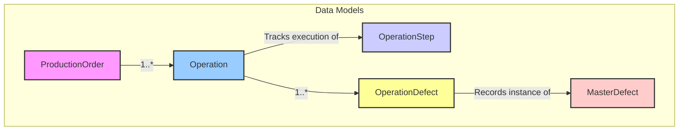

# Data Flow: Frontend to Backend

This document explains how data flows through the P-Chart application, from the user interface to the database and back. It's designed to help junior developers understand the full stack architecture.

## Data Model Overview

The core data entities and their relationships are defined in the Prisma schema:

*   **`ProductionOrder`**: Represents a manufacturing job (PO Number, Quantity, Item, Status, Current Operation details)
*   **`OperationStep`**: Defines the standard sequence of operations (e.g., OP10, OP15, OP20, OP30, OP40)
*   **`Operation`**: Represents a specific instance of an `OperationStep` being performed for a `ProductionOrder`
*   **`MasterDefect`**: Defines the master list of possible defect types (Name, Description, Category, Applicable Operation, Reworkable flag)
*   **`OperationDefect`**: Links an `Operation` instance to a `MasterDefect` type, storing quantities and rework information

### Relationship Diagram



## Architecture Overview

```
┌─────────────┐     ┌─────────────┐     ┌─────────────┐     ┌─────────────┐
│   React     │     │  Next.js    │     │   Prisma    │     │   MySQL     │
│  Components │ ──> │ API Routes  │ ──> │    ORM      │ ──> │  Database   │
│  (Frontend) │ <── │  (Backend)  │ <── │             │ <── │             │
└─────────────┘     └─────────────┘     └─────────────┘     └─────────────┘
```

## Core Business Logic Flow

### 1. Production Order Creation

When a new production order is created:

```tsx
// Frontend form submission
const handleCreatePO = async (formData) => {
  try {
    const response = await fetch('/api/production-orders', {
      method: 'POST',
      headers: { 'Content-Type': 'application/json' },
      body: JSON.stringify(formData)
    });
    
    if (!response.ok) throw new Error('Failed to create PO');
    const newPO = await response.json();
    
    // Redirect to edit view
    router.push(`/production-orders/${newPO.poNumber}`);
  } catch (error) {
    setError('Failed to create production order');
  }
};
```

The backend creates the PO and placeholder operations:

```tsx
// API route handler
export default async function handler(req, res) {
  if (req.method === 'POST') {
    try {
      const { poNumber, poQuantity, item } = req.body;
      
      // Create PO with initial status
      const po = await prisma.productionOrder.create({
        data: {
          poNumber,
          poQuantity,
          item,
          status: 'Created',
          currentOperation: 'OP10'
        }
      });
      
      // Create placeholder operations for all steps
      const operationSteps = ['OP10', 'OP15', 'OP20', 'OP30', 'OP40'];
      await Promise.all(operationSteps.map(async (step) => {
        await prisma.operation.create({
          data: {
            productionOrderId: po.id,
            operationStep: step,
            inputQuantity: step === 'OP10' ? poQuantity : 0,
            status: 'Not Started'
          }
        });
      }));
      
      return res.status(201).json(po);
    } catch (error) {
      return res.status(500).json({ error: 'Failed to create PO' });
    }
  }
}
```

### 2. Operation Execution Flow

#### Starting an Operation

```tsx
// Frontend component
const handleStartOperation = async (operationId) => {
  try {
    const response = await fetch(`/api/operations/${operationId}/start`, {
      method: 'POST',
      headers: { 'Content-Type': 'application/json' },
      body: JSON.stringify({
        operatorId: currentUser.id,
        encodedById: currentUser.id
      })
    });
    
    if (!response.ok) throw new Error('Failed to start operation');
    await response.json();
    
    // Refresh operation status
    await fetchOperationDetails();
  } catch (error) {
    setError('Failed to start operation');
  }
};
```

The backend validates and updates the operation:

```tsx
// API route handler
export default async function handler(req, res) {
  if (req.method === 'POST') {
    try {
      const { operationId } = req.query;
      const { operatorId, encodedById } = req.body;
      
      // Get operation and check previous step
      const operation = await prisma.operation.findUnique({
        where: { id: operationId },
        include: { productionOrder: true }
      });
      
      // Validate previous step completion
      if (operation.operationStep !== 'OP10') {
        const prevStep = await prisma.operation.findFirst({
          where: {
            productionOrderId: operation.productionOrderId,
            operationStep: getPreviousStep(operation.operationStep)
          }
        });
        
        if (!prevStep?.endTime) {
          return res.status(400).json({ error: 'Previous step not completed' });
        }
      }
      
      // Update operation
      const updated = await prisma.operation.update({
        where: { id: operationId },
        data: {
          startTime: new Date(),
          operatorId,
          encodedById,
          status: 'In Progress'
        }
      });
      
      // Update PO status
      await prisma.productionOrder.update({
        where: { id: operation.productionOrderId },
        data: {
          status: 'In Progress',
          currentOperation: operation.operationStep
        }
      });
      
      return res.status(200).json(updated);
    } catch (error) {
      return res.status(500).json({ error: 'Failed to start operation' });
    }
  }
}
```

#### Ending an Operation

```tsx
// Frontend component
const handleEndOperation = async (operationId, outputQuantity) => {
  try {
    const response = await fetch(`/api/operations/${operationId}/end`, {
      method: 'POST',
      headers: { 'Content-Type': 'application/json' },
      body: JSON.stringify({ outputQuantity })
    });
    
    if (!response.ok) throw new Error('Failed to end operation');
    await response.json();
    
    // Refresh operation status
    await fetchOperationDetails();
  } catch (error) {
    setError('Failed to end operation');
  }
};
```

The backend processes the operation completion:

```tsx
// API route handler
export default async function handler(req, res) {
  if (req.method === 'POST') {
    try {
      const { operationId } = req.query;
      const { outputQuantity } = req.body;
      
      // Get operation and calculate metrics
      const operation = await prisma.operation.findUnique({
        where: { id: operationId },
        include: { productionOrder: true }
      });
      
      // Calculate production hours and accumulated man hours
      const startTime = new Date(operation.startTime);
      const endTime = new Date();
      const productionHours = calculateProductionHours(startTime, endTime);
      const accumulatedManHours = calculateAccumulatedManHours(operation);
      
      // Update operation
      const updated = await prisma.operation.update({
        where: { id: operationId },
        data: {
          endTime,
          outputQuantity,
          productionHours,
          accumulatedManHours,
          status: 'Completed'
        }
      });
      
      // Update next operation's input quantity
      const nextOperation = await prisma.operation.findFirst({
        where: {
          productionOrderId: operation.productionOrderId,
          operationStep: getNextStep(operation.operationStep)
        }
      });
      
      if (nextOperation) {
        await prisma.operation.update({
          where: { id: nextOperation.id },
          data: { inputQuantity: outputQuantity }
        });
      }
      
      // Update PO status if final step
      if (operation.operationStep === 'OP40') {
        await prisma.productionOrder.update({
          where: { id: operation.productionOrderId },
          data: { status: 'Completed' }
        });
      }
      
      return res.status(200).json(updated);
    } catch (error) {
      return res.status(500).json({ error: 'Failed to end operation' });
    }
  }
}
```

### 3. Defect Recording

```tsx
// Frontend component
const handleDefectUpdate = async (operationId, defectId, quantity, quantityRework, quantityNogood) => {
  try {
    const response = await fetch(`/api/operation-defects`, {
      method: 'POST',
      headers: { 'Content-Type': 'application/json' },
      body: JSON.stringify({
        operationId,
        defectId,
        quantity,
        quantityRework,
        quantityNogood
      })
    });
    
    if (!response.ok) throw new Error('Failed to update defect');
    await response.json();
    
    // Recompute quantities if needed
    await recomputeOperationQuantities(operationId);
  } catch (error) {
    setError('Failed to update defect');
  }
};
```

The backend handles defect recording and quantity recalculation:

```tsx
// API route handler
export default async function handler(req, res) {
  if (req.method === 'POST') {
    try {
      const { operationId, defectId, quantity, quantityRework, quantityNogood } = req.body;
      
      // Create or update operation defect
      const operationDefect = await prisma.operationDefect.upsert({
        where: {
          operationId_defectId: {
            operationId,
            defectId
          }
        },
        update: {
          quantity,
          quantityRework,
          quantityNogood
        },
        create: {
          operationId,
          defectId,
          quantity,
          quantityRework,
          quantityNogood
        }
      });
      
      // Recompute quantities
      await recomputeOperationQuantities(operationId);
      
      return res.status(200).json(operationDefect);
    } catch (error) {
      return res.status(500).json({ error: 'Failed to update defect' });
    }
  }
}
```

## Global Search Flow

The application includes a global search feature for production orders. Here's how the data flows:

### 1. User Initiates Search

When a user enters a PO number in the navigation bar search:

```tsx
// Navigation component
const handleSearch = (e: FormEvent) => {
  e.preventDefault();
  if (!searchQuery.trim()) return;
  router.push(`/production-orders/${searchQuery.trim()}`);
};
```

### 2. Production Order Details Page Load

The [poNumber].tsx page loads and checks if the order exists:

```tsx
// [poNumber].tsx
useEffect(() => {
  if (poNumber) {
    // Check if order exists
    const checkOrder = async () => {
      try {
        const exists = await checkProductionOrder(poNumber);
        if (!exists) {
          // Redirect to create page with PO number
          router.push({
            pathname: '/production-orders/create',
            query: { initialPoNumber: poNumber }
          });
        }
      } catch (error) {
        console.error('Failed to check order:', error);
      }
    };
    checkOrder();
  }
}, [poNumber]);
```

### 3. API Request to Check Order

```tsx
async function checkProductionOrder(poNumber: string) {
  const response = await fetch(`/api/production-orders/check/${poNumber}`);
  if (!response.ok) {
    throw new Error('Failed to check order');
  }
  return response.json();
}
```

### 4. Database Query

```tsx
// API route handler
export default async function handler(req, res) {
  const { poNumber } = req.query;
  
  try {
    const order = await prisma.productionOrder.findUnique({
      where: { poNumber },
    });
    
    return res.status(200).json({ exists: !!order });
  } catch (error) {
    return res.status(500).json({ error: 'Failed to check order' });
  }
}
```

### 5. Create Page Pre-fill

If the order doesn't exist, the create page pre-fills the PO number:

```tsx
// create.tsx
useEffect(() => {
  if (initialPoNumber && typeof initialPoNumber === 'string') {
    setFormData(prev => ({
      ...prev,
      poNumber: initialPoNumber
    }));
  }
}, [initialPoNumber]);
```

## Step-by-Step Data Flow

### 1. User Interaction Starts the Flow

When a user interacts with the application (e.g., clicks a button, submits a form):

```jsx
// Example: Button in a React component
<button onClick={handleFetchOrders}>
  Load Production Orders
</button>

// The handler function
const handleFetchOrders = async () => {
  setIsLoading(true); // Update UI state to show loading
  try {
    const orders = await fetchProductionOrders();
    setOrders(orders); // Store data in component state
  } catch (error) {
    setError("Failed to load orders");
  } finally {
    setIsLoading(false); // Hide loading indicator
  }
};
```

### 2. Frontend Makes API Request

The frontend sends an HTTP request to the backend API:

```jsx
// API client function (typically in src/lib/api.js or similar)
async function fetchProductionOrders() {
  const response = await fetch('/api/production-orders', {
    method: 'GET',
    headers: {
      'Content-Type': 'application/json'
    }
  });
  
  if (!response.ok) {
    throw new Error('Failed to fetch orders');
  }
  
  return response.json(); // Parse JSON response
}
```

### 3. Next.js API Route Handles the Request

The API route (located in `/src/pages/api/`) receives and processes the request:

```jsx
// src/pages/api/production-orders.js
import { getSession } from "next-auth/react";
import prisma from "@/lib/prisma";

export default async function handler(req, res) {
  // 1. Check authentication
  const session = await getSession({ req });
  if (!session) {
    return res.status(401).json({ error: "Not authenticated" });
  }

  // 2. Process based on HTTP method
  if (req.method === "GET") {
    try {
      // 3. Use Prisma to interact with database
      const orders = await prisma.productionOrder.findMany({
        // Optional filtering, sorting, etc.
        orderBy: { createdAt: 'desc' },
        // Include related data if needed
        include: {
          operations: true,
        },
      });
      
      // 4. Return successful response with data
      return res.status(200).json(orders);
    } catch (error) {
      console.error("Database error:", error);
      return res.status(500).json({ error: "Failed to fetch orders" });
    }
  } else {
    // Handle unsupported methods
    res.setHeader("Allow", ["GET"]);
    return res.status(405).json({ error: `Method ${req.method} not allowed` });
  }
}
```

### 4. Prisma ORM Interacts with the Database

Prisma translates JavaScript function calls into SQL queries:

```js
// This Prisma code...
const orders = await prisma.productionOrder.findMany({
  orderBy: { createdAt: 'desc' },
  include: { operations: true },
});

// ...gets translated to SQL like:
// SELECT * FROM production_orders 
// ORDER BY created_at DESC
// (Plus additional queries to fetch related operations)
```

### 5. Database Returns Data

MySQL processes the query and returns the results back through Prisma.

### 6. API Route Formats and Returns Response

The API route processes the database results and returns a JSON response.

### 7. Frontend Receives and Processes Data

The fetch promise resolves with the data:

```jsx
// Continuing from our earlier example
const orders = await fetchProductionOrders();
setOrders(orders); // Store in React state
```

### 8. UI Updates to Display Data

React renders the component with the new data:

```jsx
// Component rendering
return (
  <div>
    {isLoading ? (
      <p>Loading orders...</p>
    ) : error ? (
      <p className="error">{error}</p>
    ) : (
      <table>
        <thead>
          <tr>
            <th>PO Number</th>
            <th>Quantity</th>
            <th>Status</th>
          </tr>
        </thead>
        <tbody>
          {orders.map(order => (
            <tr key={order.id}>
              <td>{order.poNumber}</td>
              <td>{order.poQuantity}</td>
              <td>{order.status}</td>
            </tr>
          ))}
        </tbody>
      </table>
    )}
  </div>
);
```

## Creating New Records

The process for creating records follows a similar pattern, but in reverse:

### 1. User Input

User fills out a form in the UI.

### 2. Form Submission

```jsx
const handleSubmit = async (e) => {
  e.preventDefault();
  setSubmitting(true);
  
  try {
    const newOrder = await createProductionOrder({
      poNumber: formData.poNumber,
      lotNumber: formData.lotNumber,
      poQuantity: parseInt(formData.quantity),
      // other fields...
    });
    
    // Update UI or redirect
    router.push(`/dashboard/production-orders/${newOrder.id}`);
  } catch (error) {
    setError("Failed to create order");
  } finally {
    setSubmitting(false);
  }
};
```

### 3. API Request with Data

```jsx
async function createProductionOrder(orderData) {
  const response = await fetch('/api/production-orders', {
    method: 'POST',
    headers: {
      'Content-Type': 'application/json',
    },
    body: JSON.stringify(orderData),
  });
  
  if (!response.ok) {
    throw new Error('Failed to create order');
  }
  
  return response.json();
}
```

### 4. API Route Creates Record

```jsx
// POST handler in the same API route file
if (req.method === "POST") {
  try {
    // Validate incoming data
    const { poNumber, lotNumber, poQuantity } = req.body;
    
    if (!poNumber || !poQuantity) {
      return res.status(400).json({ error: "Missing required fields" });
    }
    
    // Create record
    const newOrder = await prisma.productionOrder.create({
      data: {
        poNumber,
        lotNumber,
        poQuantity,
        status: "Created",
        // other fields...
      },
    });
    
    return res.status(201).json(newOrder);
  } catch (error) {
    // Handle unique constraint errors
    if (error.code === 'P2002') {
      return res.status(400).json({ error: "PO Number already exists" });
    }
    
    console.error("Database error:", error);
    return res.status(500).json({ error: "Failed to create order" });
  }
}
```

## Authentication Flow

Authentication affects how data flows through the application:

1. **Login Request**: User credentials are sent to `/api/auth/signin`
2. **NextAuth.js**: Verifies credentials against database or env vars
3. **Session Creation**: Creates JWT token with user info
4. **Protected Routes**: API routes check for valid session before processing
5. **Frontend Access**: Components use `useSession()` hook to get user info

```jsx
// Component using authentication
import { useSession } from "next-auth/react";

function ProtectedComponent() {
  const { data: session, status } = useSession();
  
  if (status === "loading") {
    return <p>Loading...</p>;
  }
  
  if (status === "unauthenticated") {
    return <p>Access Denied</p>;
  }
  
  // User is authenticated, show protected content
  return (
    <div>
      <h1>Welcome, {session.user.name}</h1>
      {/* Protected content */}
    </div>
  );
}
```

## Common Issues and Debugging

### CORS Errors

If you see CORS errors in development, it's usually because you're trying to access the API from a different origin.

### API Route Status Codes

- **200**: Success (GET, PUT, PATCH)
- **201**: Created successfully (POST)
- **400**: Bad request (invalid data)
- **401**: Not authenticated
- **403**: Authenticated but not authorized
- **404**: Resource not found
- **500**: Server error

### Database Connection Issues

If you see database connection errors, check:
1. Is MySQL running?
2. Is DATABASE_URL correct in .env?
3. Do you have network access to the database?

## Best Practices

1. **Error Handling**: Always include try/catch blocks
2. **Loading States**: Always show loading indicators during data fetching
3. **Data Validation**: Validate on frontend AND backend
4. **API Organization**: Keep API routes organized by feature
5. **Authentication**: Always check authentication in API routes 