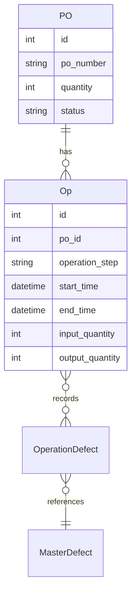

# Production Order, Operation, and Master Defect Data Flow Analysis

This document outlines the data flow and process for managing production orders, executing operation steps, and recording defects within the old P-Chart System application with Flutter, based on analysis of the codebase (`lib/` directory).

## Data Models

The application uses a local SQLite database with the following key tables:

*   **`production_orders`**: Contains production order information (PO number, quantity, item name, status).
*   **`operation_steps`**: Defines the standard sequence of operations (e.g., OP10, OP15, OP20, OP30, OP40) with step order.
*   **`operations`**: Stores execution details for each operation (start time, end time, operator, input/output quantities).
*   **`master_defects`**: Defines the master list of possible defect types (Name, Description, Category, Applicable Operation, Reworkable flag). Loaded from `assets/defects_masterlist.xlsx` into the `master_defects` table at startup.
*   **`operation_defects`**: A join table linking an `Operation` instance (`operation_id`) to a `MasterDefect` type (`defect_id`). It stores the `quantity` of that defect found during that specific operation, along with quantities designated for `rework` (`quantity_rework`) and `nogood` (`quantity_nogood`).

### Entity Relationship Diagram

## Database Service

The `DatabaseService` class (`lib/services/database_service.dart`) serves as the central component for all database operations and business logic.

### Initialization and Seed Data

*   `DatabaseService._init()`: Initializes the SQLite database.
*   `_createTables()`: Creates the required tables if they don't exist.
*   `_populateOperationSteps()`: Seeds the `operation_steps` table from a predefined list.
*   Populates the `master_defects` table from `assets/defects_masterlist.xlsx` using `_populateDefaultDefects`.

### Production Order Operations

*   **Creation (`addProductionOrder`):**
    *   Creates a record in the `production_orders` table.
    *   Initializes the first operation step (OP10) with the full production order quantity.
    *   Sets the PO status to "Created".

*   **Execution Flow:**
    *   `startOperation`: Updates the operation with a start time and the operator's ID.
    *   `completeOperation`: Sets the end time, calculates metrics, updates the PO status, and sets up the next operation step.

### Defect Management

*   **Defect Recording (`addOperationDefect`, `updateOperationDefect`):**
*   Creates or updates records in the `operation_defects` table, linking `Operation` to `MasterDefect` and storing `quantity`, `quantity_rework`, `quantity_nogood`.
*   **Output Calculation:**
*   `getTotalDefects`: Calculates the effective number of defects for an operation to determine output quantity. It considers the `MasterDefect.reworkable` flag and the `OperationDefect.quantity_rework` value (`total = SUM(CASE WHEN reworkable=1 THEN quantity - quantity_rework ELSE quantity END)`).
*   **Recalculation on Edit:**
*   Recalculates `output_quantity` (as `input_quantity` - `getTotalDefects`).
*   Propagates changes to downstream operations if an admin modifies defect quantities.

## UI Flow

### PO Add Screen

*   User enters PO number, quantity, and item name.
*   On submit, creates a new production order using `db.addProductionOrder`.
*   Redirects to the PO details screen.

### PO Details Screen

*   Displays production order information and status.
*   Shows a list of operations and their statuses (Not Started, In Progress, Completed).
*   For the active operation, provides an "Execute" button to navigate to the operation execution screen.

### Operation Execution Screen

*   Loads the relevant `Operation` record and applicable `MasterDefect` list.
*   Provides buttons to start/end the operation, setting `start_time` and `end_time`.
*   Allows input of defect quantities (QTY, NG) via text fields. RW is calculated. Input is disabled after completion unless the user is an Admin.
*   Calls `db.addOperationDefect` when defect quantities change.
*   If defects are modified by an Admin *after* completion, it triggers `db.recomputeOperationQuantities`.

## Workflow Sequences

### Creating a Production Order

1.  User navigates to "Add PO" screen.
2.  User enters PO number, quantity, and item.
3.  `DatabaseService.addProductionOrder` creates the PO and initializes the first operation step.
4.  User is redirected to the PO details screen.

### Executing an Operation

1.  User navigates to the PO details screen.
2.  User selects an operation and clicks "Execute".
3.  User presses "Start" to set the start time (`db.startOperation`).
4.  Enters defect quantities as they occur. (`db.addOperationDefect` updates `operation_defects`). Screen shows running totals.
5.  When done, user presses "End" to complete the operation (`db.completeOperation`).
6.  System calculates metrics, updates operation and PO status, and sets up the next operation.

## Key Calculations

*   **Output Quantity**: `input_quantity` - `total_effective_defects`
*   **Total Effective Defects**: Sum of defects, accounting for reworkable items (`quantity - quantity_rework`)
*   **Pass Rate**: `output_quantity / input_quantity * 100`
*   **Accumulated Man-Hours**: Running total of production hours for a PO
